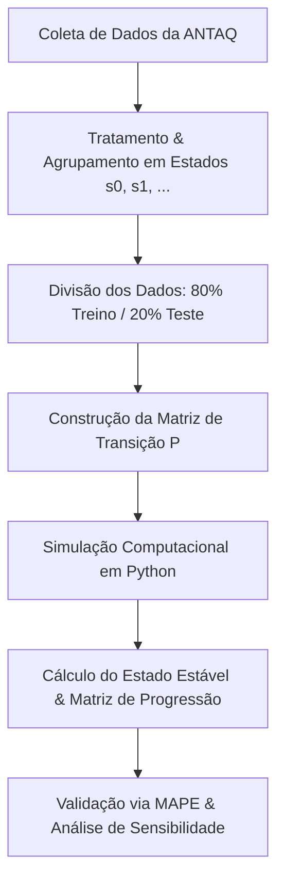

 ## ⛴ Modelagem do Tempo de Espera dos Navios no Porto de Santos

[](LICENSE)
[](https://www.python.org/)
[](https://www.cps.sp.gov.br/)
[](https://fatecbs.edu.br/)
[](#-status-do-projeto-e-cronograma)

> **Projeto de Iniciação Científica e Tecnológica (PIBICT — Bolsa CEETEPS)**  
> **Curso:** CST em Ciência de Dados — Faculdade de Tecnologia da Baixada Santista Rubens Lara (Fatec Baixada Santista) — CEETEPS  
> **Bolsista:** Giulia Dias Granado de Marques  
> **Orientador:** Prof. Dr. João Paulo Ferreira de Mello  

---

## 📌 Sobre o Projeto

Este repositório reúne os códigos, dados históricos e documentações do projeto de pesquisa voltado à **Modelagem do Tempo de Espera dos Navios para Atracação no Porto de Santos**.

O Porto de Santos é o maior complexo portuário da América Latina e enfrenta gargalos operacionais no fluxo de atracação que geram custos significativos (*demurrage* e perda de eficiência). A pesquisa combina **Cadeias de Markov** e **Teoria de Filas** aplicadas aos registros individuais de atracação disponibilizados publicamente pela **ANTAQ** (Agência Nacional de Transportes Aquaviários) para estimar probabilidades de transição entre estados de congestionamento e prever o tempo médio de espera no curto prazo (1 a 3 semanas).

*Nota: O projeto foi contemplado com bolsa de Iniciação Científica pelo **CEETEPS (Centro Paula Souza)** e segue o plano de trabalho detalhado elaborado para a pesquisa.*

---

## 🎯 Objetivos

### Objetivo Geral
Modelar e simular o tempo de espera dos navios para atracação no Porto de Santos utilizando Cadeias de Markov e Teoria de Filas, desenvolvendo uma ferramenta probabilística de apoio à decisão para a Autoridade Portuária e operadores logísticos anteciparem cenários de congestionamento e otimizarem a alocação de berços.

### Objetivos Específicos
- **Revisão Bibliográfica:** Mapeamento de literatura em logística portuária, processos estocásticos, Cadeias de Markov e Teoria de Filas.
- **Tratamento e Clustering de Dados:** Coleta e limpeza dos dados históricos da ANTAQ, categorizando os tempos de espera em estados operacionais discretos ($s0, s1, s2, \dots$).
- **Construção da Matriz de Transição:** Estimação das probabilidades de transição ($p_{ij}$) a partir de 80% do conjunto de dados (treinamento).
- **Simulação Computacional:** Implementação em Python para cálculo do Estado Estável (*Steady State*) e geração de matrizes de progressão temporal.
- **Validação e Sensibilidade:** Avaliação do modelo em 20% dos dados (teste) utilizando o Erro Médio Absoluto Percentual (**MAPE**) e análise de sensibilidade sob variações de demanda e capacidade.

---

## 🛠 Metodologia e Pipeline de Dados



### Stack Tecnológico
- **Linguagem:** Python 3.10+
- **Manipulação e Análise de Dados:** `pandas`, `numpy`
- **Visualização Gráfica:** `matplotlib`, `seaborn`
- **Modelagem & Simulação:** Scripts customizados em Python e Jupyter Notebooks

---

## 📂 Estrutura do Repositório

```text
.
├── data/       # Conjunto de dados históricos da ANTAQ e documentações estatísticas
├── docs/       # Projeto de pesquisa, relatórios científicos e apresentações
├── src/        # Scripts em Python para tratamento, modelagem e simulação (em dev)
├── trash/      # Rascunhos, análises exploratórias temporárias e testes de gráficos
├── LICENSE     # Licença de código aberto (MIT)
└── README.md   # Documentação principal do projeto
```

---

## 🚀 Como Executar o Projeto

### Pré-requisitos
Ter o **Python 3.10+** e o **Git** instalados na sua máquina.

### Passo a Passo

1. **Clonar o repositório:**
   ```bash
   git clone https://github.com/giuliagranado/Markov-chains.git
   cd Markov-chains
   ```

2. **Criar e ativar um ambiente virtual:**
   ```bash
   # Linux/macOS
   python3 -m venv venv
   source venv/bin/activate

   # Windows
   python -m venv venv
   venv\Scripts\activate
   ```

3. **Instalar as dependências:**
   ```bash
   pip install numpy pandas matplotlib seaborn
   ```

4. **Explorar as análises:**
   Navegue até a pasta `data/` para inspecionar os conjuntos de dados ou execute os scripts na pasta `src/`.

---

## 📅 Cronograma e Status de Execução (2026/2027)

O cronograma de execução da bolsa de Iniciação Científica do CEETEPS abrange o período de **Setembro/2026 a Agosto/2027**:

| Período | Atividade Prevista | Status |
| :--- | :--- | :---: |
| **Set - Out/2026** | Revisão bibliográfica sobre logística portuária e estudo teórico (Markov/Filas) | [/] Em Andamento |
| **Nov - Dez/2026** | Definição dos estados do sistema e coleta/tratamento dos dados (ANTAQ) | [ ] A Iniciar |
| **Jan - Fev/2027** | Estimação de parâmetros e construção da matriz de transição ($P$) | [ ] A Iniciar |
| **Mar - Abr/2027** | Implementação computacional em Python, simulações e geração de gráficos | [ ] A Iniciar |
| **Mai - Jun/2027** | Validação do modelo com conjunto de teste (20% via MAPE) e análise de sensibilidade | [ ] A Iniciar |
| **Jul - Ago/2027** | Escrita final do relatório e submissão do artigo no 41º Congresso ANPET (2027) | [ ] A Iniciar |

### Checklist do Repositório
- [x] Elaboração da proposta de pesquisa e concessão da bolsa CEETEPS.
- [x] Estruturação do repositório no GitHub.
- [/] Revisão bibliográfica e organização inicial da base de dados da ANTAQ na pasta `data/`.
- [ ] Análise exploratória detalhada e clustering dos estados operacionais ($s0, s1, \dots$).
- [ ] Implementação da matriz de probabilidade $P$ e do vetor de estado estacionário em Python (`src/`).
- [ ] Validação do modelo e cálculo do erro MAPE.
- [ ] Redação do artigo para o 41º Congresso ANPET (2027).

---

## 👩‍💻 Equipe e Instituições

| Papel | Nome | Instituição / Vínculo |
| :--- | :--- | :--- |
| **Pesquisadora / Bolsista** | Giulia Dias Granado de Marques | Ciência de Dados — Fatec Rubens Lara |
| **Orientador** | Prof. Dr. João Paulo Ferreira de Mello | Docente — Fatec Rubens Lara |
| **Instituição de Ensino** | FATEC Baixada Santista Rubens Lara | CEETEPS / Governo do Estado de São Paulo |
| **Agência de Fomento** | CEETEPS | Bolsa de Iniciação Científica |

---

## 📖 Referências Fundamentais

1. **ANTAQ.** *Estatístico Aquaviário*. Agência Nacional de Transportes Aquaviários, 2024. Disponível em: <https://www.gov.br/antaq/>.
2. **AUTORIDADE PORTUÁRIA DE SANTOS.** *Facts & Figures 2025*. Santos: Porto de Santos, 2025.
3. **AZEVEDO, K. C. F. et al.** *Tempo de atracação dos navios no Porto de Santos: uma aplicação de Regressão Quantílica*. UFF, 2024.
4. **FERREIRA, W. C.** *Estudo básico das Cadeias de Markov e aplicações de matrizes em probabilidade*. UEPB, 2025.
5. **PRUYN, J. F. J.; KANA, A. A.; GROENEVELD, W. M.** *Analysis of port waiting time due to congestion by applying Markov chain analysis*. In: *Maritime Supply Chains*. Elsevier, 2020, p. 69–94.
6. **RODRIGUES, P. E.** *Uma Breve Introdução à Teoria das Filas*. Goiânia: IFG, 2020.
7. **ROSS, S. M.** *Introduction to Probability Models*. 12. ed. San Diego: Academic Press, 2019.

---

## 📜 Licença

Este projeto é de código aberto e está sob a licença [MIT](LICENSE).
