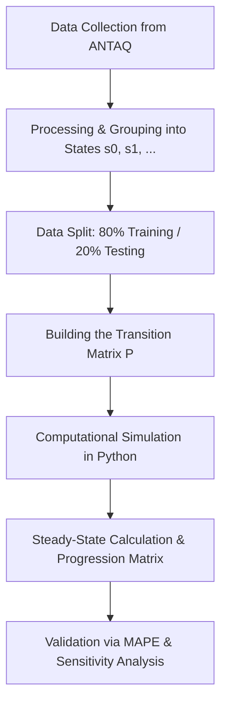

## ⛴ Modeling Ship Waiting Times at the Port of Santos
 
[](LICENSE)
[](https://www.python.org/)
[](https://www.cps.sp.gov.br/)
[](https://fatecbs.edu.br/)
[](#-project-status-and-timeline)
 
> **Scientific and Technological Initiation Project (PIBICT — CEETEPS Grant)**
> **Program:** B.Tech in Data Science — Faculdade de Tecnologia da Baixada Santista Rubens Lara (Fatec Baixada Santista) — CEETEPS
> **Scholarship holder:** Giulia Dias Granado de Marques
> **Advisor:** Prof. Dr. João Paulo Ferreira de Mello
 
---
 
## 📌 About the Project
 
This repository gathers the code, historical data, and documentation for the research project on **Modeling Ship Waiting Times for Berthing at the Port of Santos**.
 
The Port of Santos is the largest port complex in Latin America and faces operational bottlenecks in the berthing flow that generate significant costs (*demurrage* and loss of efficiency). The research combines **Markov Chains** and **Queueing Theory** applied to individual berthing records made publicly available by **ANTAQ** (Brazilian National Waterway Transportation Agency) to estimate transition probabilities between congestion states and forecast average short-term waiting time (1 to 3 weeks).
 
*Note: The project was awarded a Scientific Initiation grant by **CEETEPS (Centro Paula Souza)** and follows the detailed work plan drawn up for the research.*
 
---
 
## 🎯 Objectives
 
### General Objective
Model and simulate ship waiting times for berthing at the Port of Santos using Markov Chains and Queueing Theory, developing a probabilistic decision-support tool for the Port Authority and logistics operators to anticipate congestion scenarios and optimize berth allocation.
 
### Specific Objectives
- **Literature Review:** Mapping the literature on port logistics, stochastic processes, Markov Chains, and Queueing Theory.
- **Data Processing and Clustering:** Collection and cleaning of ANTAQ historical data, categorizing waiting times into discrete operational states ($s0, s1, s2, \dots$).
- **Building the Transition Matrix:** Estimating transition probabilities ($p_{ij}$) from 80% of the dataset (training set).
- **Computational Simulation:** Implementation in Python to compute the Steady State and generate time-progression matrices.
- **Validation and Sensitivity Analysis:** Evaluating the model on the remaining 20% of the data (test set) using the Mean Absolute Percentage Error (**MAPE**) and sensitivity analysis under variations in demand and capacity.
---
 
## 🛠 Methodology and Data Pipeline
 

 
### Tech Stack
- **Language:** Python 3.10+
- **Data Handling and Analysis:** `pandas`, `numpy`
- **Graphical Visualization:** `matplotlib`, `seaborn`
- **Modeling & Simulation:** Custom Python scripts and Jupyter Notebooks
---
 
## 📂 Repository Structure
 
```text
.
├── data/       # ANTAQ historical datasets and statistical documentation
├── docs/       # Research proposal, scientific reports, and presentations
├── src/        # Python scripts for processing, modeling, and simulation (in dev)
├── trash/      # Drafts, temporary exploratory analyses, and chart tests
├── LICENSE     # Open-source license (MIT)
└── README.md   # Main project documentation
```
 
---
 
## 🚀 How to Run the Project
 
### Prerequisites
Have **Python 3.10+** and **Git** installed on your machine.
 
### Step by Step
 
1. **Clone the repository:**
```bash
   git clone https://github.com/giuliagranado/Markov-chains.git
   cd Markov-chains
```
 
2. **Create and activate a virtual environment:**
```bash
   # Linux/macOS
   python3 -m venv venv
   source venv/bin/activate
 
   # Windows
   python -m venv venv
   venv\Scripts\activate
```
 
3. **Install dependencies:**
```bash
   pip install numpy pandas matplotlib seaborn
```
 
4. **Explore the analyses:**
   Browse the `data/` folder to inspect the datasets or run the scripts in the `src/` folder.
---
 
## 📅 Timeline and Execution Status (2026/2027)
 
The execution timeline for the CEETEPS Scientific Initiation grant covers the period from **September/2026 to August/2027**:
 
| Period | Planned Activity | Status |
| :--- | :--- | :---: |
| **Sep - Oct/2026** | Literature review on port logistics and theoretical study (Markov/Queueing) | [/] In Progress |
| **Nov - Dec/2026** | Definition of system states and data collection/processing (ANTAQ) | [ ] Not Started |
| **Jan - Feb/2027** | Parameter estimation and construction of the transition matrix ($P$) | [ ] Not Started |
| **Mar - Apr/2027** | Computational implementation in Python, simulations, and chart generation | [ ] Not Started |
| **May - Jun/2027** | Model validation with the test set (20% via MAPE) and sensitivity analysis | [ ] Not Started |
| **Jul - Aug/2027** | Final report writing and paper submission to the 41st ANPET Congress (2027) | [ ] Not Started |
 
### Repository Checklist
- [x] Drafting of the research proposal and award of the CEETEPS grant.
- [x] Setting up the repository on GitHub.
- [/] Literature review and initial organization of the ANTAQ dataset in the `data/` folder.
- [ ] Detailed exploratory analysis and clustering of operational states ($s0, s1, \dots$).
- [ ] Implementation of the probability matrix $P$ and the steady-state vector in Python (`src/`).
- [ ] Model validation and MAPE error calculation.
- [ ] Writing the paper for the 41st ANPET Congress (2027).
---
 
## 👩‍💻 Team and Institutions
 
| Role | Name | Institution / Affiliation |
| :--- | :--- | :--- |
| **Researcher / Grant Holder** | Giulia Dias Granado de Marques | Data Science — Fatec Rubens Lara |
| **Advisor** | Prof. Dr. João Paulo Ferreira de Mello | Faculty — Fatec Rubens Lara |
| **Educational Institution** | FATEC Baixada Santista Rubens Lara | CEETEPS / Government of the State of São Paulo |
| **Funding Agency** | CEETEPS | Scientific Initiation Grant |
 
---
 
## 📖 Key References
 
1. **ANTAQ.** *Estatístico Aquaviário*. Brazilian National Waterway Transportation Agency, 2024. Available at: <https://www.gov.br/antaq/>.
2. **AUTORIDADE PORTUÁRIA DE SANTOS.** *Facts & Figures 2025*. Santos: Port of Santos, 2025.
3. **AZEVEDO, K. C. F. et al.** *Ship berthing time at the Port of Santos: an application of Quantile Regression*. UFF, 2024.
4. **FERREIRA, W. C.** *A basic study of Markov Chains and matrix applications in probability*. UEPB, 2025.
5. **PRUYN, J. F. J.; KANA, A. A.; GROENEVELD, W. M.** *Analysis of port waiting time due to congestion by applying Markov chain analysis*. In: *Maritime Supply Chains*. Elsevier, 2020, p. 69–94.
6. **RODRIGUES, P. E.** *A Brief Introduction to Queueing Theory*. Goiânia: IFG, 2020.
7. **ROSS, S. M.** *Introduction to Probability Models*. 12th ed. San Diego: Academic Press, 2019.
---
 
## 📜 License
 
This project is open source and licensed under the [MIT](LICENSE) License.
 
